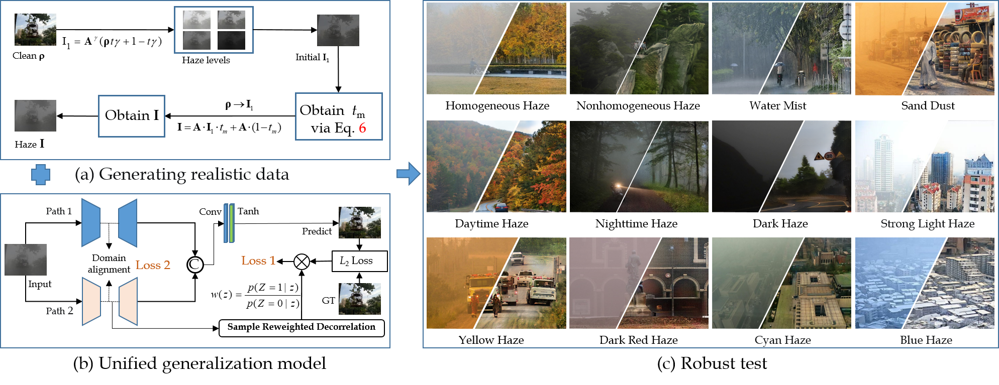
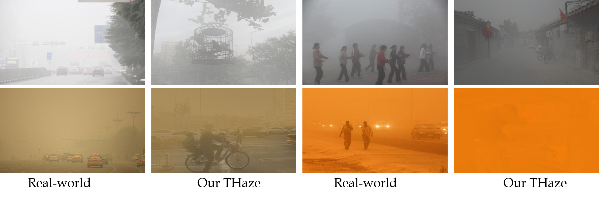
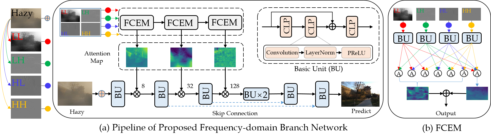
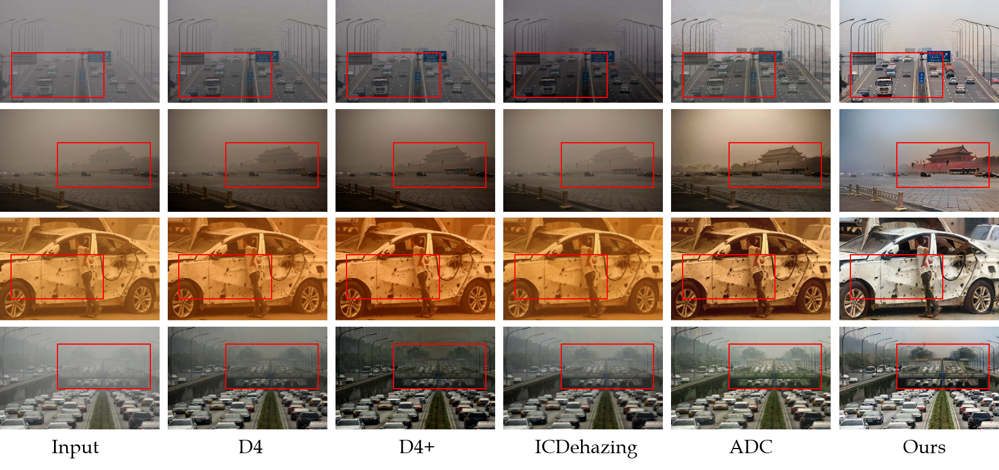

# Bridging the Gap Between Haze Scenarios: A Unified Image Dehazing Model - TCSVT 2024

This is the official PyTorch implementation of CGID.  

## Abstract:
In real-world scenarios, the haze presents diversity and complexity. However, current dehazing researches usually focus solely on specific categories or the removal of common white haze, frequently lacking the ability to adapt across various unknown haze types. In this study, our emphasis is on constructing a model that shows excellent adaptability across diverse haze conditions. Unlike approaches that solely rely on network structure design to enhance model adaptability, we comprehensively improve dehazing model adaptability from three key aspects: constructing the multitype haze dataset from designed haze degradation models, designing the network architecture, and formulating training strategies suitable for cross-scene generalization. Firstly, to meet the diverse haze training data requirements, we design a multitype haze degradation model to generate more realistic pairs of hazy images. Secondly, to ensure thorough haze removal and natural restoration of texture details in the recovered images, we construct a dual-branch ensemble network framework by leveraging pre-trained clear image prior features and the characteristics of 2D discrete wavelet priors. Finally, to further enhance the adaptability for removing various types of haze, we employ a sample reweighting decorrelation strategy during the network training phase to eliminate dependencies between haze and haze-free background features. Through extensive experiments, our approach shows remarkable performance across diverse haze scenarios. Our method not only outperforms state-of-the-art scene-specific dehazing methods in typical scenarios like daytime and nighttime, but it also excels in handling challenging scenarios such as dusty conditions, and color haze. See more results https://github.com/fyxnl/Image-dehazing-CGID.




See more details in [[paper]](https://ieeexplore.ieee.org/document/10557647)

## Environment:

- Windows: 10

- CUDA Version: 11.0 
- Python 3.7

## Dependencies:

- torch==1.7.0
- torchvision==0.7.0
- NVIDIA GPU and CUDA

## Pretrained Weights & Dataset

1. Download [Dehaze weights](https://pan.baidu.com/s/1wP5CziCdza3mluzMEia9Qw ) and Extraction code: [4232]
2. Load the pre-trained weights [Res2Net](https://pan.baidu.com/s/14JAHqX0xvFTpGXAqVBqMCQ) and Extraction code: [1234]
3. Our training data will be released once it's sorted out. Data layer generalization can be achieved with our data.
. 

## train
Our train run is simple, It can be trained with slight modifications.

The designed frequency domain network branch.


## Test

Our test run is simple, just change the input and output paths according to your requirements

```
python CGID_test.py
```

## Qualitative Results



## Acknowledgement

We thank the authors of [DWGAN](https://arxiv.org/abs/2104.08911). Part of our code is built upon their modules.

 
## Citation

If our work helps your research, please consider to cite our paper:

Y. Feng, L. Ma, X. Meng, F. Zhou, R. Liu and Z. Su, "Bridging the Gap Between Haze Scenarios: A Unified Image Dehazing Model," in IEEE Transactions on Circuits and Systems for Video Technology, doi: 10.1109/TCSVT.2024.3414677

 


